<div align="center">



<p>
  A desktop app, local runtime, and web console for
  <a href="https://github.com/NousResearch/hermes-agent">Hermes Agent</a> —
  chat with agents, manage models and profiles, connect platform channels,
  automate jobs, and run coding agents, all on your own machine.
</p>

<p>
  <a href="https://www.npmjs.com/package/@pythoughts/hermes-ui"></a>
  <a href="https://hub.docker.com/r/elkaix/hermes-ui"></a>
  <a href="./LICENSE"></a>
  = 23"/>
  
</p>

<p>
  <a href="#quick-start">Quick Start</a> ·
  <a href="#features">Features</a> ·
  <a href="#configuration">Configuration</a> ·
  <a href="./docs/docker.md">Docker</a> ·
  <a href="./DEVELOPMENT.md">Development</a>
</p>


</div>

## Overview

Hermes UI is a self-hosted control plane for [Hermes Agent](https://github.com/NousResearch/hermes-agent). It runs agent conversations with streaming responses and tool traces, and gives you one dashboard for profiles, providers, models, credentials, memory, skills, plugins, automation, and logs. It ships three ways — a native desktop app, an npm CLI, and a Docker image — and keeps all data local.

> [!NOTE]
> Everything stays on your machine. Hermes Agent data lives in `~/.hermes`, and UI state (sessions, auth, uploads) lives in `~/.hermes-ui` unless `HERMES_UI_HOME` is set.

| Area | What Hermes UI does |
| --- | --- |
| Agent chat | Streaming Hermes Agent conversations with tool traces, file upload/download, and persistent local sessions. |
| Local control plane | Manage profiles, providers, models, credentials, memory, skills, plugins, logs, and runtime settings from one dashboard. |
| Automation | Configure platform channels, cron jobs, Kanban tasks, group-chat rooms, and MCP servers around the same profiles. |
| Workspace tools | File browser, web terminal, voice input/output, coding-agent runners, device discovery, and performance views. |
| Distribution | Desktop app for Windows/macOS/Linux, an npm CLI package, and a Docker image. |

## Quick Start

### Desktop app (recommended)

Download the latest installer from [GitHub Releases](https://github.com/Pythoughts-labs/hermes-ui/releases/latest). Builds are published for macOS, Windows, and Linux. The desktop app bundles the UI runtime and starts the local server automatically.

After first launch it installs managed command shims:

| Command | Description |
| --- | --- |
| `hermes-ui` | Open the Hermes UI desktop app |
| `hermes-ui cli ...` | Run the bundled Hermes Agent CLI |
| `hermes-ui web ...` | Run the bundled `hermes-ui` command |
| `hermes-ui-mcp` | Run the managed UI MCP bridge |

### npm

```bash
npm install -g @pythoughts/hermes-ui
hermes-ui start
```

Then open **http://localhost:8648**.

> [!IMPORTANT]
> Requires Node.js **>= 23**.

### Docker Compose

Single-container deployment with an integrated Hermes Agent:

```bash
# Use the pre-built image (recommended)
UI_IMAGE=pythoughtslabs/hermes-ui docker compose up -d

# Or build from source
docker compose up -d --build

docker compose logs -f hermes-ui
```

Then open **http://localhost:6060**. Persistent data is stored in `./hermes_data`; the auth token is written to `./hermes_data/hermes-ui/.token` and printed to the container logs on first run. See [`docs/docker.md`](./docs/docker.md) for details.

## Features

### Agent chat

Real-time streaming over Socket.IO, multi-session management, and a local SQLite session store separate from Hermes' read-only history. Markdown rendering with syntax highlighting, expandable tool-call details, profile-scoped uploads, and path-based downloads across local, Docker, SSH, and Singularity backends. Sessions group by source (Telegram, Discord, Slack, …), pin live runs to the top, and are searchable with `Ctrl+K`.

### Platform channels

Configure **8 platforms** from one page — Telegram, Discord, Slack, WhatsApp, Matrix, Feishu (Lark), WeChat (QR login), and WeCom. Credentials write to `~/.hermes/.env` and behavior settings to `~/.hermes/config.yaml`, with per-platform configured/unconfigured detection.

### Models & profiles

Auto-discover models from the credential pool, fetch provider model lists, and manage preset or custom OpenAI-compatible providers (including OpenAI Codex and Nous Portal OAuth). Create, clone, import, export, and switch Hermes profiles, with account-bound access — super admins manage every profile; regular admins only see profiles assigned to them.

### Automation & workspace

- **Scheduled jobs** — create, edit, pause, resume, and trigger cron jobs with quick presets.
- **Kanban** — a profile-aware board for planning and tracking agent work.
- **Group chat** — multi-agent rooms with `@mention` routing, context compression, and SQLite persistence.
- **Coding agents** — launch and monitor local Codex and Claude Code sessions from the dashboard.
- **File browser** — browse, edit, and transfer files across local, Docker, SSH, and Singularity backends.
- **Web terminal** — node-pty + xterm with multi-session support and resize.

### Voice (TTS / STT)

Read assistant replies aloud and dictate turns from the chat input. Providers include browser Web Speech, built-in Edge TTS, OpenAI-compatible `/audio/speech`, custom endpoints, and MiMo (preset voices, voice design, and voice cloning). Provider keys are stored server-side and only masked status is returned to the browser.

> [!WARNING]
> Custom/OpenAI-compatible and MiMo base URLs must be public `http`/`https` endpoints — they cannot target localhost or private networks. External providers may keep processing a request after the browser or server aborts.

### Analytics, logs & admin

Token usage breakdowns, session counts, estimated cost and cache-hit tracking, model-usage distribution, and a 30-day trend. Filterable agent/server/error logs with structured parsing. LAN peer discovery, an MCP manager for the managed `hermes-ui` server, version-preview tooling, and performance views for super admins.

### Authentication

Token-based auth (auto-generated or set via `AUTH_TOKEN`) plus username/password login with account management.

> [!CAUTION]
> Default bootstrap credentials are `admin` / `admin`. You are prompted to change them after first login — do so before exposing the server.

CLI maintenance:

```bash
hermes-ui clear-login-locks            # clear persisted login IP locks
hermes-ui clear-login-locks --restart  # clear locks and restart the server
hermes-ui reset-default-login          # reset the super-admin login to admin / admin
```

## Configuration

Provider keys and agent settings are normally managed through Hermes profiles; the variables below are process-level overrides. The most common ones:

| Variable | Default | Description |
| --- | --- | --- |
| `PORT` | `8648` | UI listen port. |
| `BIND_HOST` | `0.0.0.0` | Bind host. Set `::` for IPv6. |
| `HERMES_UI_HOME` | `~/.hermes-ui` | Data home for auth token, credentials, logs, DB, and uploads. |
| `AUTH_TOKEN` | auto-generated | Explicit bearer token. |
| `AUTH_JWT_SECRET` | `AUTH_TOKEN` | JWT signing secret for username/password sessions. |
| `PROFILE` | `default` | Startup/default Hermes profile. |
| `CORS_ORIGINS` | same host only | Cross-origin allowlist for HTTP, Socket.IO, and WebSocket. |
| `LOG_LEVEL` | `info` | Server log level. |
| `WORKSPACE_BASE` | user home | Base directory for workspace browsing. |
| `HERMES_HOME` | platform default | Hermes data home (`%LOCALAPPDATA%\hermes` on Windows, `~/.hermes` elsewhere). |

<details>
<summary>All environment variables</summary>

| Variable | Default | Description |
| --- | --- | --- |
| `PORT` | `8648` | UI listen port. |
| `BIND_HOST` | `0.0.0.0` | UI bind host. Set `::` explicitly for IPv6. |
| `HERMES_UI_HOME` | `~/.hermes-ui` | UI data home for auth token, credentials, logs, DB, and default uploads. `HERMES_UI_STATE_DIR` is also supported as a compatibility alias. |
| `HERMES_UI_STATE_DIR` | unset | Compatibility alias for `HERMES_UI_HOME`. |
| `HERMES_UI_DISABLE_MCP_AUTOINJECT` | unset | Disable startup injection of the managed `hermes-ui` MCP server into Hermes profile configs. |
| `HERMES_UI_ALLOW_TRANSIENT_MCP_AUTOINJECT` | unset | Allow managed MCP injection when `HERMES_UI_HOME` is under a temporary directory, such as Version Preview runtimes. |
| `UPLOAD_DIR` | `$HERMES_UI_HOME/upload` | Upload root override. Files are stored below profile-scoped subdirectories. |
| `CORS_ORIGINS` | same host only | Comma- or space-separated cross-origin allowlist for HTTP, Socket.IO, and WebSocket requests. Set `*` only when you intentionally need legacy wildcard CORS. |
| `AUTH_TOKEN` | auto-generated | Explicit bearer token. If unset, UI creates one under `HERMES_UI_HOME`. |
| `AUTH_JWT_SECRET` | `AUTH_TOKEN` | JWT signing secret override for username/password sessions. |
| `PROFILE` | `default` | Startup/default Hermes profile. Runtime requests use the profile selected by the frontend and authorized for the current account. |
| `LOG_LEVEL` | `info` | Server log level. |
| `BRIDGE_LOG_LEVEL` | `$LOG_LEVEL` or `info` | Bridge log level. |
| `MAX_DOWNLOAD_SIZE` | `200MB` | Maximum file download size. |
| `MAX_EDIT_SIZE` | `10MB` | Maximum editable file size. |
| `WORKSPACE_BASE` | current user's home directory | Base directory for workspace browsing. |
| `HERMES_HOME` | platform default | Hermes data home. Windows uses `%LOCALAPPDATA%\hermes`; macOS/Linux uses `~/.hermes`. |
| `HERMES_BIN` | `hermes` | Custom Hermes CLI binary path. |
| `HERMES_AGENT_ROOT` | auto-discovered | Hermes Agent source checkout containing `run_agent.py`. |
| `HERMES_AGENT_BRIDGE_PYTHON` | auto-discovered | Python interpreter used to launch the agent bridge. |
| `HERMES_AGENT_BRIDGE_UV` | auto-discovered | `uv` executable used to launch the agent bridge when available. |
| `UV` | auto-discovered | Fallback `uv` executable path. |
| `PYTHON` | auto-discovered | Fallback Python executable for the agent bridge. |
| `HERMES_AGENT_BRIDGE_ENDPOINT` | platform default | Agent bridge broker endpoint. Windows defaults to `tcp://127.0.0.1:18765`; macOS/Linux defaults to `ipc:///tmp/hermes-agent-bridge.sock`. |
| `HERMES_AGENT_BRIDGE_TIMEOUT_MS` | `120000` | Timeout for Node requests to the bridge broker. |
| `HERMES_AGENT_BRIDGE_CONNECT_RETRY_MS` | `5000` | Short retry window for connecting to the bridge socket. |
| `HERMES_AGENT_BRIDGE_STARTUP_TIMEOUT_MS` | `120000` | Timeout while waiting for the Python bridge to become ready. |
| `HERMES_AGENT_BRIDGE_STOP_ON_SHUTDOWN` | enabled | Stop the bridge broker during UI shutdown and restart. Set `0`, `false`, `no`, or `off` to keep the bridge across restarts. |
| `HERMES_AGENT_BRIDGE_AUTO_RESTART` | enabled | Auto-restart the bridge broker after unexpected exit. Set `0`, `false`, `no`, or `off` to disable. |
| `HERMES_AGENT_BRIDGE_RESTART_DELAY_MS` | `1000` | Base delay for bridge auto-restart backoff. |
| `HERMES_AGENT_BRIDGE_PLATFORM` | `cli` | Platform identity passed to Hermes Agent. |
| `HERMES_AGENT_BRIDGE_WORKER_TRANSPORT` | platform default | Profile worker transport. Set `tcp` for loopback TCP or `ipc`/`unix` for Unix domain sockets; defaults to Windows TCP and macOS/Linux IPC. |
| `HERMES_AGENT_BRIDGE_WORKER_PORT_BASE` | `18780` | Base port for TCP worker endpoints. |
| `HERMES_BRIDGE_PROVIDER` | profile/default | Provider override for bridge runs. |
| `HERMES_BRIDGE_TOOLSETS` | profile/default | Toolset override for bridge runs. |
| `HERMES_BRIDGE_MAX_TURNS` | profile/default | Maximum turn override for bridge runs. |
| `HERMES_BRIDGE_SUPPRESS_PLATFORM_HINT` | `cli` | Controls bridge platform hint suppression passed to Hermes Agent. |
| `HERMES_OPENROUTER_APP_REFERER` | `https://github.com/Pythoughts-labs/hermes-ui` | OpenRouter attribution referer sent by bridge runs. |
| `HERMES_OPENROUTER_APP_TITLE` | `Hermes UI` | OpenRouter attribution title sent by bridge runs. |
| `HERMES_OPENROUTER_APP_CATEGORIES` | `cli-agent,personal-agent` | OpenRouter attribution categories sent by bridge runs. |
| `HERMES_UI_MANAGED_GATEWAY` | enabled | Controls UI-managed Hermes gateway process handling. Set `0`, `false`, `no`, or `off` to use `hermes gateway start` instead. |
| `HERMES_UI_DISABLE_GATEWAY_AUTOSTART` | unset | Skip startup gateway checks/autostart. Set `1`, `true`, `yes`, or `on` for dashboard-only deployments where another service owns Hermes gateway lifecycle. |
| `HERMES_UI_DISABLE_SKILL_INJECTION` | unset | Skip startup bundled skill injection. Set `1`, `true`, `yes`, or `on` when bundled skills are managed outside Hermes UI. |
| `HERMES_UI_STOP_GATEWAYS_ON_SHUTDOWN` | enabled in production | Controls whether UI shutdown also stops managed gateway processes. Set `0` or `false` to detach them. |
| `HERMES_GATEWAY_URL` / `GATEWAY_URL` | unset | Explicit Hermes gateway upstream URL for proxy routes. |
| `GATEWAY_HOST` | `127.0.0.1` | Default Hermes gateway upstream host for proxy routes. |
| `GATEWAY_PORT` | `8642` | Default Hermes gateway upstream port for proxy routes. |
| `HERMES_UI_PREVIEW_REPO` | package repository | GitHub repository used by Version Preview. |
| `HERMES_UI_PREVIEW_AGENT_BRIDGE_TRANSPORT` | platform default | Version Preview broker transport. |
| `HERMES_UI_PREVIEW_AGENT_BRIDGE_ENDPOINT` | isolated preview endpoint | Directly overrides the Version Preview broker endpoint. |
| `HERMES_UI_BACKEND_PORT` | `8648` | Backend port used by the Vite dev proxy. |
| `HERMES_UI_FRONTEND_PORT` | `8649` | Frontend Vite dev server port. |

</details>

### CLI commands

| Command | Description |
| --- | --- |
| `hermes-ui start` | Start in background (daemon mode) |
| `hermes-ui start --port 9000` | Start on a custom port |
| `hermes-ui stop` | Stop the background process |
| `hermes-ui restart` | Restart the background process (stops the bridge by default) |
| `hermes-ui status` | Check if running |
| `hermes-ui update` | Update to the latest version and restart |
| `hermes-ui -v` | Show the version number |
| `hermes-ui -h` | Show help |

> [!TIP]
> `restart`, `update`, and `upgrade` stop the Agent Bridge broker by default so restarted servers don't reuse stale Python bridge processes. Set `HERMES_AGENT_BRIDGE_STOP_ON_SHUTDOWN=0` to keep the bridge alive across restarts.

## Architecture

```
Browser → BFF (Koa, :8648) → Socket.IO /chat-run
                ↓
        Hermes agent bridge → Hermes Agent runtime
                ↓
           Hermes CLI / profiles
           profile config.yaml    (channel/provider behavior)
           profile auth.json      (credential pool)
           Tencent iLink API      (WeChat QR login)
```

The frontend is built for **multi-agent extensibility** — all Hermes-specific code is namespaced under `hermes/` directories (API, components, views, stores), so new agent integrations can sit alongside it. The BFF layer handles Socket.IO chat streaming, the agent bridge, profile-aware uploads and multi-backend downloads, session CRUD, account- and profile-scoped management, config and credential management, WeChat QR login, model discovery, skills/memory/plugins, TTS/STT, coding-agent proxies, MCP/runtime management, log reading, and static serving.

**Tech stack:** Vue 3 · TypeScript · Vite · Naive UI · Pinia · Vue Router · vue-i18n · SCSS · markdown-it · highlight.js · Koa 2 · node-pty.

## Development

```bash
git clone https://github.com/Pythoughts-labs/hermes-ui.git
cd hermes-ui
npm install
npm run dev
```

- Frontend: http://localhost:8649
- BFF server: http://localhost:8647

```bash
npm run build   # outputs to dist/
npm test        # run the test suite
```

See [DEVELOPMENT.md](./DEVELOPMENT.md) for the full development guide.
